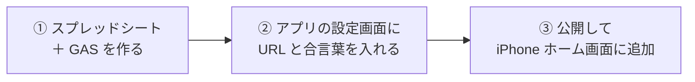

# 初回セットアップ（15 分）

やることは 3 つ。**① スプレッドシート＋GAS を作る → ② アプリに URL と合言葉を入れる → ③ 公開して iPhone に追加**。

---

## ① スプレッドシート＋GAS を作る

1. Google ドライブで **新しいスプレッドシート** を作る（名前は `mindful-log` など何でもよい）
2. メニュー **拡張機能 → Apps Script** を開く
3. 最初から入っている `function myFunction() {}` を消し、[`gas/Code.gs`](../gas/Code.gs) の中身を**全部貼り付けて保存**
4. 左メニュー **⚙ プロジェクトの設定 → スクリプト プロパティ → プロパティを追加**
   - プロパティ：`SECRET`
   - 値：自分で決めた合言葉（例：ランダムな英数字 16 文字）
   - ⚠️ この値はチャットにも Git にも書かない
5. 右上 **デプロイ → 新しいデプロイ**
   - 種類：**ウェブアプリ**
   - 次のユーザーとして実行：**自分**
   - アクセスできるユーザー：**全員**（合言葉で守るので OK）
   - **デプロイ** → 出てきた **ウェブアプリの URL**（`.../exec` で終わる）をコピー
   - 初回は「承認」画面が出る。自分の Google アカウントで許可する
6. 夜 21 時の未記録チェックを有効にする：エディタ上部で関数 `setupTrigger` を選んで **▶ 実行**（1 回だけ）

> ⚠️ コードを直したら **デプロイ → デプロイを管理 → 編集 → バージョン：新バージョン** で更新しないと反映されない。

## ② アプリに URL と合言葉を入れる

1. アプリを開き、ホーム下の **設定** をタップ
2. ①-5 の URL と、①-4 の合言葉を入れて **保存**
3. ホームに戻り **気分を記録 → 数字をタップ**。「記録しました」と出てスプレッドシートに 1 行増えれば成功

保存先はその端末の中（localStorage）だけ。リポジトリには入らない。端末を変えたら入れ直す。

## ③ 公開して iPhone のホーム画面に追加

| 方法 | 条件 | 手順 |
|---|---|---|
| **GitHub Pages** | ⚠️ 無料プランでは **public リポジトリのみ**。private のままなら Pro 以上が必要 | リポジトリ **Settings → Pages → Branch: main / (root) → Save**。数分で `https://<ユーザー名>.github.io/mindful-app/` が使える |
| Cloudflare Pages / Netlify | private のままでも無料で可 | GitHub 連携でこのリポジトリを選ぶだけ（ビルド設定なし、出力ディレクトリ `/`） |

公開できたら iPhone の Safari で URL を開き、**共有 → ホーム画面に追加**。

## 動作確認チェックリスト（実機でしか分からない項目）

- [ ] 瞑想の終了音が鳴る（iPhone のサイレントスイッチが ON だと鳴らない場合がある）
- [ ] 目を閉じたまま、上・中・下の雑念ボタンを押し分けられる
- [ ] 完了画面に「スプレッドシートに保存しました」と出る
- [ ] 記録が 0 件の日の 21 時にメールが届く

## うまくいかないとき

| 症状 | 原因の候補 |
|---|---|
| 「合言葉が違います」 | スクリプト プロパティの `SECRET` とアプリの設定が不一致 |
| 「URL が GAS の Web App ではないようです」 | URL が `/exec` で終わっていない。または「アクセスできるユーザー」が「全員」になっていない |
| 「サーバーが応答しません」 | 電波がない、または GAS 側でエラー。Apps Script の **実行数** 画面でログを見る |
| メールが来ない | `setupTrigger` を実行していない。**トリガー** 画面に `checkTodayAndNotify` があるか確認 |
