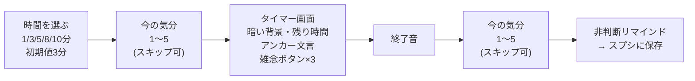
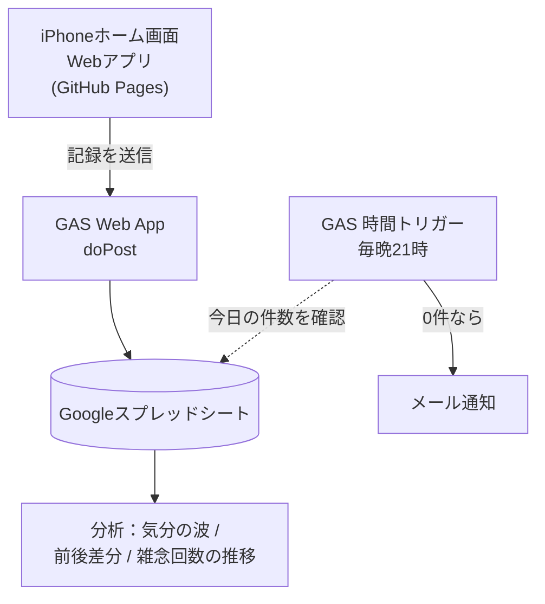

# mindful-app 仕様書（v1）

`作成: 2026-09-13` / 個人利用専用

> このファイルは実装前の壁打ちで決まった内容の確定版です。実装を始める前に必ず全部読んでください。

---

## 1. 目的

マインドフルネスを**継続**し、**気分の数値がどう変化するかを自分のデータで検証する**。

「瞑想アプリ」であると同時に「自分を被験者にした効果測定ツール」である、という二重の性格を持つ。後者が既存の瞑想アプリとの違い。

## 2. 使う人・環境

| 項目 | 内容 |
|---|---|
| 利用者 | 本人のみ（他人には配らない） |
| 主な端末 | **iPhone**（Safari、ホーム画面に追加して使う） |
| 副 | PC ブラウザからも同じ URL で使える |
| 開発環境 | Windows |

## 3. 画面は3つ

| 画面 | 中身 |
|---|---|
| **① ホーム** | 「気分を記録」「瞑想する」の大きなボタン2つ＋今日の記録件数 |
| **② 気分だけ記録** | 1〜5 のボタンをタップ → 即送信 → 完了表示。**2秒で終わること** |
| **③ 瞑想セッション** | 時間選択 → 前スコア → タイマー → 後スコア |

### ②「気分だけ記録」の設計方針

**1日に複数回入力して「気分の波」を取ることが目的。** そのため入力の手間を極限まで減らす。

- 画面を開いて **1タップで完了**。確認画面もメモ入力も出さない
- 送信後は完了表示を出して自動でホームに戻る

### ③ 瞑想セッションの流れ

## 4. 瞑想セッションの詳細仕様

### 4-1. 時間の選択肢

`1 / 3 / 5 / 8 / 10 分`（**初期値 3分**）

- **3分がデフォルト**：「1回20分より、1〜5分を毎日」が継続の定石
- **1分は挫折防止の逃げ道**：疲れた日に「3分すら億劫」でスキップするのを防ぐための最小行動

### 4-2. アンカー文言（意識を戻す先）

タイマー画面に表示する。以下の3種から選択または順番に表示。

- 足の裏の感覚（床に触れている圧力・温度）
- 坐骨の重み（椅子やクッションに乗っているお尻・骨盤）
- お腹の上下（呼吸の物理的な動き）

**⚠️ 条件分岐：前スコアが 1 または 2 のとき**は、アンカー文言の代わりに **RAIN法の1行**を表示する。

> 例：「感情を責めずにただ認め、お腹や胸の感覚に寄り添いましょう」

理由：調子が悪い日に「呼吸を観察する」だけでは感情に引きずられやすいため。
**文言は必ず1行に収めること**（長文は瞑想の妨げになる）。

### 4-3. 雑念ボタン（ラベリング）

`考え事` / `不安` / `計画` の3つ。

| ルール | 理由 |
|---|---|
| タップしても**画面は変わらない** | 瞑想を中断させないため |
| タップしても**音を出さない** | 同上 |
| **回数だけ数える** | 「雑念の量の推移」が上達の指標になる |
| **上下3分割の巨大ボタン**として配置（上＝考え事／中＝不安／下＝計画） | 目を閉じたまま指の位置感覚だけで押し分けられるようにするため |

**⚠️ 使ってみて重いと感じたら、v1.1 で「1つのボタン（ただ気づいた）」に簡略化できるよう、データの持ち方を柔軟にしておくこと。**

### 4-4. 終了の知らせ

- **音**で知らせる（Web Audio）
- ⚠️ **バイブは実装しない**。iOS Safari は Vibration API 非対応のため物理的に不可能
- ⚠️ 画面を消した状態でのタイマー継続は不安定。3分なら画面を見ている前提で設計する

### 4-5. 終了画面の「非判断リマインド」【必須】

スコア入力後の完了画面に、以下のような**1行**を表示する。

> 「雑念に気づいて戻した回数こそが、脳のトレーニング成果です」

**これは飾りではなく安全装置。** 雑念回数が数値で残ると人は「少ない＝良い」と読み、「今日は考え事が多くてダメだった」と自分を責める（自己不承認）。ストレスを減らすためのアプリがストレスを生む逆転を防ぐ。

同じ理由で、**記録一覧でも雑念回数を「減らすべき数字」として目立たせない見せ方にすること。**

## 5. データ設計（Google スプレッドシート）

| 列 | 例 | 用途 |
|---|---|---|
| `timestamp` | 2026-09-13 08:12 | 時間帯別の**気分の波**の計測 |
| `type` | `quick` / `pre` / `post` | 単独記録か、瞑想の前後か |
| `score` | 4 | 気分（1〜5。1=とても悪い、5=とても良い） |
| `session_id` | s-0093 | 前と後をペアにする |
| `duration_min` | 3 | 1／3／5／8／10 |
| `label_kangae` | 5 | 雑念「考え事」の回数 |
| `label_fuan` | 2 | 雑念「不安」の回数 |
| `label_keikaku` | 0 | 雑念「計画」の回数 |
| `memo` | （任意） | 自由記述 |

### スコアの定義

質問は**「今の気分」の1問だけ**。1=とても悪い 〜 5=とても良い。
質問を増やすと入力が重くなり継続しないため、増やさない。

## 6. 技術構成

| 要素 | 技術 |
|---|---|
| フロント | HTML / CSS / JavaScript（フレームワークなし） |
| ホスティング | GitHub Pages |
| 保存先 | Google スプレッドシート |
| 書き込み | GAS Web App（`doPost`） |
| 通知 | GAS の時間主導型トリガー ＋ `MailApp` |

### ⚠️ セキュリティ上の注意

GAS Web App の URL は「リンクを知っている全員」が実行できる公開URLになる。URLを知られると第三者が書き込めてしまう。

対策：
- **簡単な合言葉（共有シークレット）をリクエストに含め、GAS 側で照合する**
- URL と合言葉は `.env` に置き、**コミットしない**
- ⚠️ フロントの JS に合言葉が載る以上、完全な秘匿ではない。個人用・非公開前提で許容する

### エラー処理（v1の範囲）

- 送信失敗したら**赤く表示＋再送ボタン**のみ
- ⚠️ オフライン時の自動保存・自動再送は **v1では作らない**

## 7. 通知

| 方式 | 役割 | 実装 |
|---|---|---|
| **iPhoneのアラーム** | 行動のトリガー（If-Then の If） | アプリ外。本人が手動設定 |
| **メール通知** | 未実行の検知（フェールセーフ） | GAS が毎晩21時にチェック、**その日の記録が0件なら送信** |

**「瞑想してない」ではなく「記録が0件」を検知するのが正しい。** 瞑想しない日の気分記録こそが効果検証の比較対象になるため（→ 第8章）。

通知を送る部分は**関数1つに切り出しておく**。メールが埋もれて効かなかった場合、LINE 等に差し替えられるようにするため。

⚠️ LINE Notify は終了済みのため、LINE を使うなら Messaging API になる（未検証）。

## 8. 効果検証の設計

### 8-1. 見るもの（4週間を1区切り）

| 見たいこと | 使うデータ |
|---|---|
| **その場の効果** | `post` − `pre` の差分の平均 |
| **持ち越し効果** | 瞑想した日の翌日のスコア vs しなかった日の翌日 |
| **気分の波** | `timestamp` × `score`（時間帯別・曜日別） |
| **上達したか** | 雑念回数の週ごとの推移 |
| **最適な長さ** | `duration_min` 別の前後差分 |

### 8-2. 前後スコアが検証の核

「瞑想した日は気分が良い」だけでは**因果が逆の可能性**（気分が良い日だから瞑想できた）を排除できない。
**同一セッションの直前と直後を比べる**ことで、その場の効果を切り出せる。

### 8-3. ベースライン期間（任意・運用のみ、機能は不要）

| 期間 | やること |
|---|---|
| Day 1〜3 | **瞑想はしない**。気分記録だけ1日3回 |
| Day 4〜28 | 瞑想も始める |

「瞑想していない時の自分の平常値」が取れる。⚠️ 始める意欲を削ぐなら省略してよい。省略しても、瞑想しなかった日のクイック記録が比較対象になる。

### 8-4. ⚠️ 引用データについて

壁打ち中に挙がった統計値（`r=0.50`、`39%→91%`、`2.3〜3倍` 等）は**出典を確認できていない（未検証）**。
設計判断は「自己批判はストレスを増やす」「If-Then は効く」という定性的な部分だけで成立しているので、数値は参考程度に扱う。

## 9. v1 に入れないもの

| 機能 | 理由 |
|---|---|
| ガイド音声 | 音源制作が本体より重い |
| HRV（カメラ心拍） | 実装難度・精度ともに問題 |
| 脳波デバイス連携（Muse2等） | 実機が必要 |
| **MAAS / FFMQ / MSES-R 質問紙** | v2。⚠️ 出版された心理尺度のため、設問文をリポジトリに入れるのは権利面で避ける。やるならスプレッドシートに手動でタブを作る |
| If-Then プランニングの管理機能 | iPhone のアラームで代替 |
| Web プッシュ通知 | 専用サーバが必要。GAS だけでは送れない |
| 記録の修正・削除UI | スプレッドシートで直接直せるのが本構成の強み |
| オフライン自動再送 | v1 は手動再送ボタンのみ |

## 10. 実装の進め方（メモ）

1. まず `index.html` だけで「前スコア → タイマー → 後スコア → 画面に表示」まで動かす（保存なし）
2. 次に GAS Web App を作り、スプレッドシートに書き込めるようにする
3. 次に「気分だけ記録」を足す
4. 最後に GAS の時間トリガーで通知を足す
5. GitHub Pages に公開し、iPhone のホーム画面に追加して実機確認

**⚠️ 1〜2 の間で必ず iPhone 実機で触る。** 音が鳴るか、雑念ボタンが目を閉じて押せるかは実機でしか分からない。
